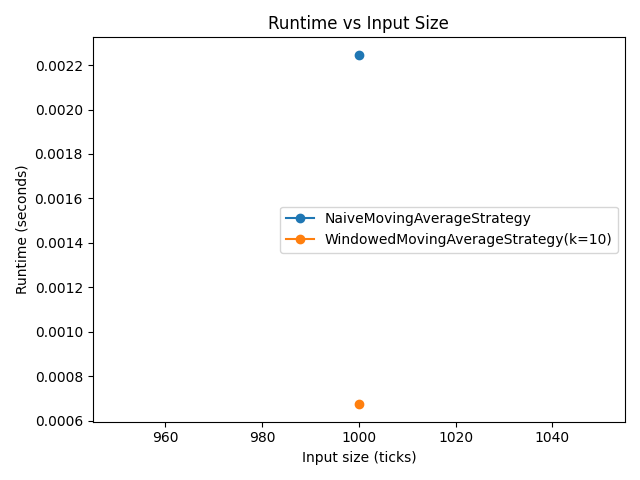
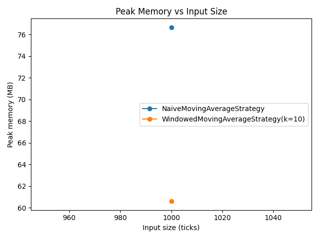

# Complexity Report: Runtime & Space Complexity in Financial Signal Processing

## Benchmark Table (timeit + memory_profiler)

| Strategy | Ticks | Runtime (s) | Peak Memory (MB) |
|---|---:|---:|---:|
| NaiveMovingAverageStrategy | 1000 | 0.002246 | 76.67 |
| WindowedMovingAverageStrategy(k=10) | 1000 | 0.000675 | 60.59 |

## Scaling Plots

## Theoretical Complexity Annotations

- **NaiveMovingAverageStrategy**: per-tick time **O(i)** (worst **O(n)**) due to `sum(full_history)`; total over n ticks **O(n²)**; space **O(n)** because it stores the full price history.
- **WindowedMovingAverageStrategy**: per-tick time **O(1)** using a fixed-size window and running sum; total **O(n)**; space **O(k)** where k is the window size.

## Narrative Comparison

The naive implementation recomputes the moving average from scratch each tick by summing the entire history, so runtime grows superlinearly and becomes impractical as n increases. The windowed strategy maintains only the last k prices and a running sum, making each update constant-time. Memory usage for the naive approach grows linearly with n, while the windowed approach stays bounded by k.
